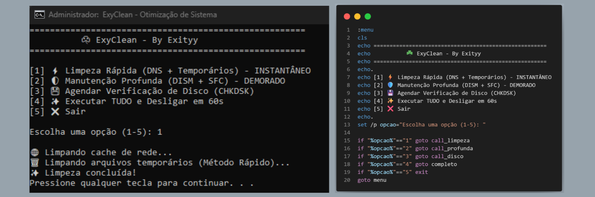

# ☘️ ExyClean - Otimização de Sistema

O **ExyClean** é um script de automação desenvolvido para otimizar a manutenção preventiva e corretiva de sistemas Windows. O projeto nasceu da necessidade de agilizar processos rotineiros no dia a dia de infraestrutura e monitoramento (NOC).

## 🚀 Funcionalidades

O script é modularizado, permitindo que o usuário escolha o nível de manutenção necessário:

1.  **⚡ Limpeza Rápida:** Limpa o cache de DNS e arquivos temporários do sistema (`%temp%`) de forma instantânea utilizando manipulação de diretórios para maior performance.
2.  **🛡️ Manutenção Profunda:** Executa as ferramentas integradas do Windows para reparo de imagem e integridade de arquivos (DISM e SFC).
3.  **💾 Agendamento de Disco:** Configura o **CHKDSK** para ser executado no próximo boot, garantindo a saúde do sistema de arquivos.
4.  **✨ Modo Completo:** Executa todas as tarefas sequencialmente e agenda o desligamento da máquina.

## 📸 Screenshots

  

## 🛠️ Tecnologias Aplicadas

* **Batch Script:** Linguagem nativa para automação Windows.
* **Modularização:** Uso de `labels` e `call` para reuso de código e controle de fluxo.
* **Tratamento de Erros:** Verificação automática de privilégios de Administrador.
* **Escapamento de Caracteres:** Técnicas para garantir a integridade do pipe (`|`) em blocos lógicos complexos.

## ⚠️ Como usar

1.  Faça o download do arquivo `ExyClean.bat`.
2.  Clique com o botão direito e selecione **"Executar como Administrador"**.
3.  Escolha a opção desejada no menu interativo.

---
Desenvolvido por **Exityy** 🚀
